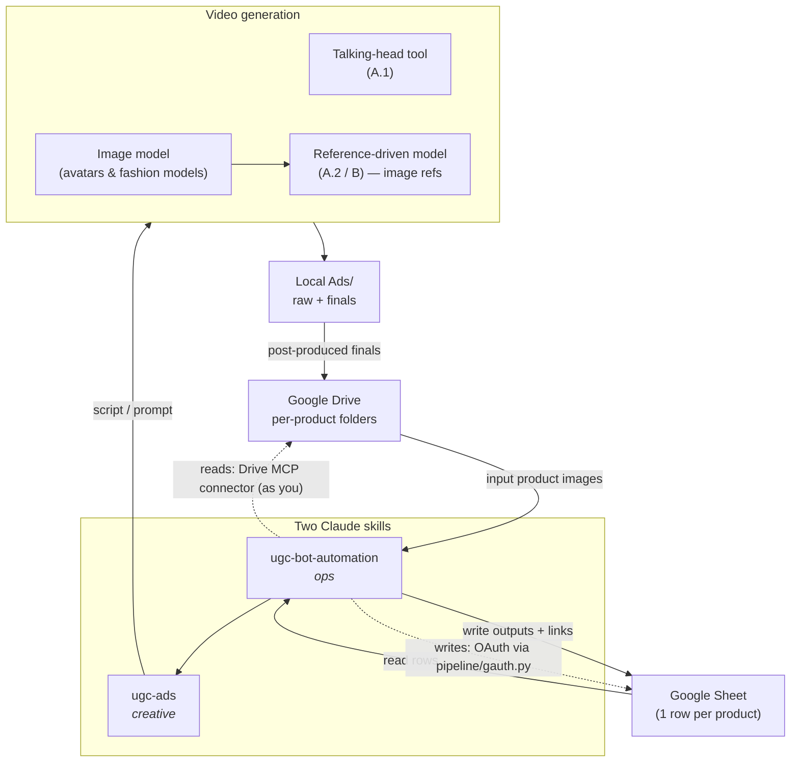

# UGC Ads Automation — Template

A reusable, **agent-driven pipeline to mass-produce UGC-style ads** from a Google Sheet, built for [Claude Code](https://claude.com/claude-code) (or any agent with shell + Google + a video-gen tool). Each sheet row is a product; the agent writes the script, generates a talking-head/creator video with a chosen avatar, you post-produce, and the final lands in Drive + the sheet.

This is a **generic template** — bring your own brand, products, sheet, and video model. (Built and battle-tested on a real eyewear catalog; all private values stripped.)

## Two "brains" (Claude skills)
| Brain | Skill | Owns |
|---|---|---|
| **Creative** | `skills/ugc-ads/` | ad types (Product-First, Yapping), scripts, brand voice, avatars, generation params |
| **Automation** | `skills/ugc-bot-automation/` | Sheet ↔ Drive ↔ video model plumbing, OAuth, folder structure |

Install: drop each `skills/<name>/` folder into `~/.claude/skills/<name>/`.

## How it works
1. **Sheet** (columns): `PID Name | Drive Link | Product Detail Page | Claude Script | Feedback | Status | Count | Style | Avatar | Video Output | Job ID`
2. **`run scripts`** → agent reads each product (Drive images + product page) and writes a script into `Claude Script`. **Stops for your approval.**
3. You review, optionally edit `Feedback`, set `Status = Approved`.
4. **`run approved`** → agent generates `Count` video(s) in `Style` with a chosen avatar, you post-produce, it uploads finals to Drive and marks the row `Done`.

## Ad formats
Two **types**; Product-First has several **production formats**:

| Code | Format | What it is | Engine |
|------|--------|-----------|--------|
| **A.1** | Talking Head | Creator talks to camera | Talking-head avatar tool (avatar + product + TTS lip-sync) |
| **A.2** | Split-Screen | Music-driven product-flex montage in stacked panels (2-split studio / 3-split outdoor), no talking | Reference-driven model (image refs), e.g. Seedance 2.0 |
| **A.3** | Product Modelling | Product worn/used on a model, showcase motion | TBD |
| **B** | Yapping | Creator rambles a story, then pivots to product | Reference-driven model |

Recipes + gotchas live in `skills/ugc-ads/product-first-ugc.md` and `yapping-ugc.md`.

## Architecture



- **Reads** — Google Drive MCP connector (as you) or a service account (`pipeline/sheet.py`).
- **Writes** — **OAuth as you** (`pipeline/gauth.py`, Drive + Sheets API) — works even in locked-down Workspaces.
- **Generation** — your video models: a talking-head tool (A.1) and a reference-driven model with consistent-identity image refs (A.2/B); an image model mints avatars + fashion models.
- **Glue** — shell + local `Ads/<product>/{raw,final}/` folders.

## Setup
See `skills/ugc-bot-automation/RUNBOOK.md` ("Setup"). In short: enable Drive + Sheets APIs, create a **Desktop OAuth client** → `.secrets/oauth_client.json`, run `python3 -u pipeline/gauth.py login`, fill `pipeline/config.json` with your sheet id.

```
pip3 install --user gspread google-auth google-auth-httplib2 google-auth-oauthlib google-api-python-client
```

## Hard-won gotchas
- Enterprise Workspaces often **block service-account sharing** → use OAuth-as-user.
- File-connector MCPs **can't upload big videos** or **edit cells** → use `gauth.py`.
- Browser automation **can't log into Google** → not a write path.
- Enable **both** Drive + Sheets APIs; wait for propagation.
- **Never commit `.secrets/`.**

## Layout
```
skills/ugc-ads/            creative skill (SKILL.md, product-first-ugc.md, yapping-ugc.md)
skills/ugc-bot-automation/ ops skill (SKILL.md, RUNBOOK.md)
pipeline/                  gauth.py, sheet.py, config.json, README.md
Ads/<PID>_<slug>/{raw_higgsfield,final}/   per-product outputs (gitignored media)
.secrets/                  your keys/tokens — gitignored, never commit
```

## License
MIT. No warranty. You are responsible for your own brand assets, API usage, content rights, and compliance.

---
🤖 Scaffolded with Claude Code.
